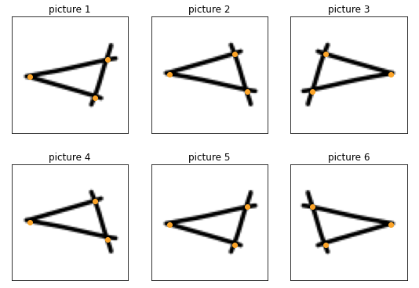

# tf_keras_generator_with_targets
## Simple Custom TensorFlow image Generator where **target** values are also **modified**

When we want to **augment** a dataset of images with **coordinates as targets** (e.g., vertices of a shape, coordinates for body landmarks), we need a way to implement a ImageDataGenerator to modify the target variables according to the image transformation. For example, if the image is flipped horizontally, the target coordinates must be flipped also.


---
## Use Case: Mix on Pix
I encountered this requirement when building the model to determine the vertices (angular points) of shapes like triangles or rectangles for the Auto-Shapes functionnality of the iOS app **[Mix on Pix](https://apps.apple.com/us/app/mix-on-pix-text-on-photos/id633281586)**.

In general and for **[Mix on Pix](https://apps.apple.com/us/app/mix-on-pix-text-on-photos/id633281586)** in particular, the Image generator is very important as it allows to augment the image dataset by doing rotations (0-360), horizontal and vertical flips of the images.

---

### Generators
- Simple generator: [tf_generator_with_target.ipynb](tf_generator_with_target.ipynb). Supports horizontal and vertical flip. **Note**: Also viewable from [here](https://nbviewer.jupyter.org/github/frobertpixto/tf_keras_generator_with_targets/blob/main/tf_generator_with_target.ipynb). 

---
### Usage in code
When used in the code to fit the model, we can now do:

```
batch_size = 64
pixto_gen  = MyDataGenerator(partition, X_train, Y_train, batch_size=batch_size, n_vertices=3)
```

and then:
```
#Fit the model with data Augmentation
epochs  = 36 
history = model.fit(x=pixto_gen,
                    epochs = epochs, validation_data = (X_val,Y_val),
                    verbose = 1, steps_per_epoch=X_train.shape[0] // batch_size,
                    callbacks=[learning_rate_reduction])
```                              

Note that this syntax where we directly specify `model.fit(x=pixto_gen` is new to TensorFlow 2.1.
Previous versions must use `model.fit_generator`. 

by Francois Robert